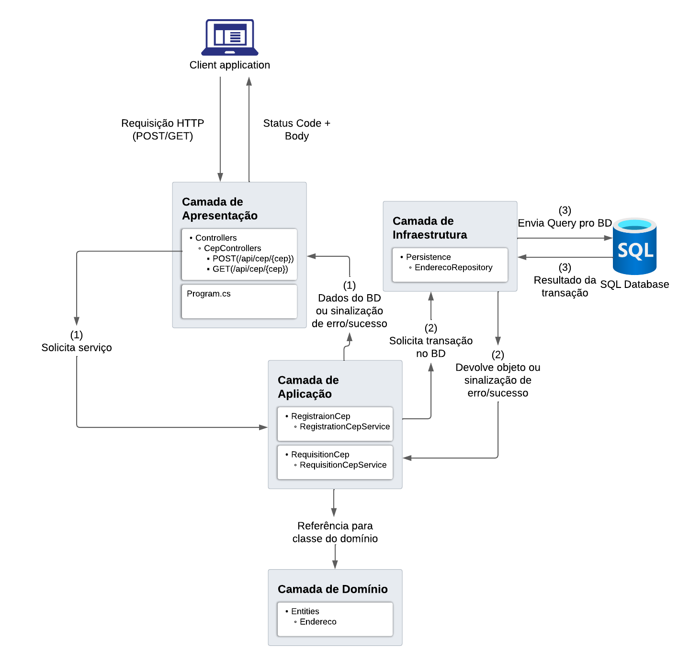

<h1 style="font-family: 'Century';">
DESAFIO NEGOCIE
</h1>

Web api feita com .NET 8, seguindo o padrão de projeto DDD (Domain-Driven Design),
de forma que a aplicação consiste de 4 camadas:

- Camada de apresentação
- Camada de aplicação
- Camada de infraestrutura
- Camda de domínio

## CAMADA DE APRESENTAÇÃO

Contém os endpoints na pasta controllers. Os endpoints recebem a requisição e passam para a próxima camada lidar com o processamento, depois retornam o resultado para o cliente. Também capturam as exceções lançadas pelas camadas inferiores, e retornam o código http apropriado.

## CAMADA DE APLICAÇÃO

Recebe a requisição da camada de apresentação, faz as validações, aplica as regras de negócio, passa para a camada de infraestrutura fazer a comunicação com o banco de dados, e retorna o resultado da transação ou lança uma exceção para a camada de apresentação.

## CAMADA DE INFRAESTRUTURA

Responsável por abrir conexão com o banco de dados, enviar queries, fazer o mapeamento objeto-relacional, recuperar registros do banco de dados e fazer a persistência dos objetos no mesmo. Sinaliza erros para a camada de aplicação com o lançamento de exceções.

## CAMADA DE DOMÍNIO

Contém as entidades do domínio, no caso apenas uma, "Endereco", que contém os dados de um CEP.

## ENDPOINTS

<lu>
    <li>
        (GET) http://localhost:5197/api/cep/{cep} 
    </li>
    <li>
        (POST) http://localhost:5197/api/cep/{cep} 
    </li>
</lu>

## TRATAMENTOS DE EXCEÇÕES

|       Exceção         |Origem   |       Ocorrência                                        | Status Code retornado |
|        :---:          |:---:    |        :---:                                            |:---:                  |
|ArgumentException      |GET/POST |Cliente enviou um cep em formato inválido                |400                    |
|KeyNotFoundException   |GET      |Cep não está no banco de dados                           |404                    |
|KeyNotFoundException   |POST     |Cep não existe na api dos correios                       |404                    |
|DuplicateNameException |POST     |Tentativa de inserir registro duplicado no banco de dados|409                    |
|HttpRequestException   |POST     |API de correios não respondeu                            |502                    |
|NpgsqlException        |GET/POST |Erro ao tentar realizar transação no banco de dados      |500                    |
|Exception              |GET/POST |Algum erro mais genérico                                 |500                    |

## EXECUÇÃO

Para executar, é necessário ter o Dotnet 8 instalado em seu ambiente.

---

    git clone https://github.com/rafael2051/.NET-API-DDD.git

---

    cd .NET-API-DDD

---

    dotnet run --project .\Desafio-NEGOCIE.Api\

---

A string de conexão se encontra em appsettings.json. No campo ConnectionString de ConnectionSettings, insira a sua string de conexão.

## FLUXO DOS DADOS

